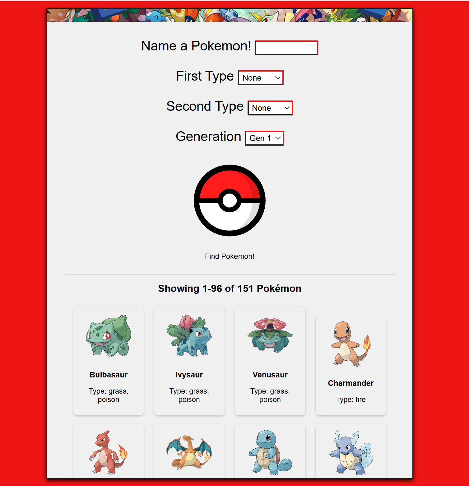
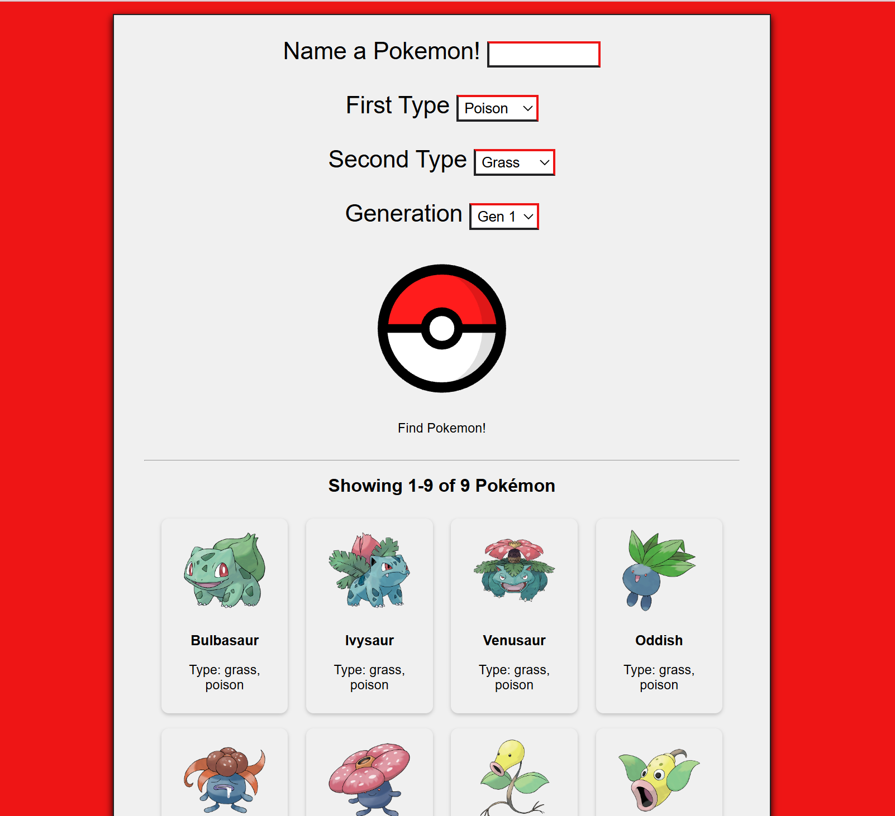
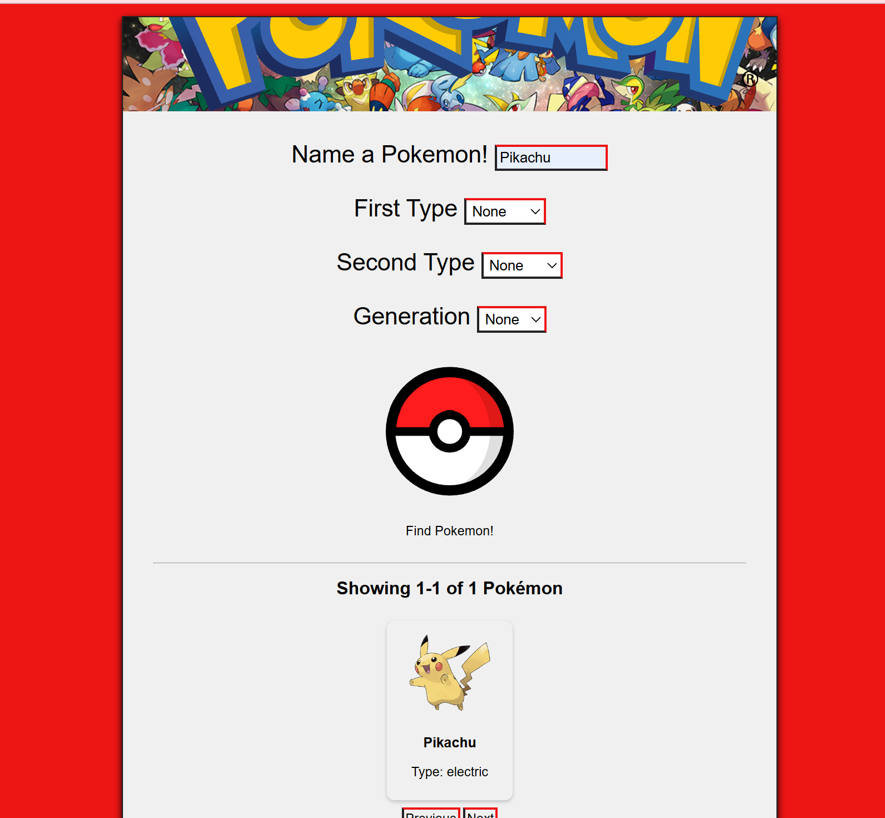

# Pokémon Picker

**A responsive web app for searching and filtering Pokémon by name, type, and generation.**

A solo-built web application that lets users search and filter the full roster of Pokémon by multiple criteria, pulling live data from the official Pokémon API and adapting cleanly across desktop, tablet, and mobile.

*A solo front-end project built around a public API.*

**[Try it in your browser →](https://people.rit.edu/jel2360/235/Project2/pokemonPicker.html)**

---

  

  

  

---

## Overview

Pokémon Picker is a solo-built web app for browsing Pokémon through multi-criteria search. Users can filter by name, type, and generation, and the app fetches and displays detailed data live from the official Pokémon API. Recent searches persist between visits via local storage, and the interface adapts fluidly to whatever device it's viewed on.

## Features

- **Multi-criteria search & filtering** — Find Pokémon by name, type, and generation.
- **Live API data** — Detailed Pokémon information is fetched and displayed dynamically from the official Pokémon API.
- **Persistent recent searches** — Local storage remembers recent searches for a seamless return experience.
- **Fully responsive** — An intuitive layout that adapts across desktop, tablet, and mobile.

## Development Highlights

- Developed a solo **web application** enabling users to search and filter Pokémon by name, type, and generation.
- Integrated the official **Pokémon API** to dynamically display detailed Pokémon data based on multi-criteria searches.
- Implemented **local storage** to persist recent searches, improving usability and creating a seamless return experience.
- Designed a **responsive, intuitive interface** that adapts fluidly across desktop, tablet, and mobile devices.

## Built With

- **Languages:** JavaScript, HTML, CSS
- **API:** PokéAPI (the official Pokémon API)
- **Storage:** Browser local storage

## Try It & Run

Use it instantly in your browser, no install required:

**[Open Pokémon Picker →](https://people.rit.edu/jel2360/235/Project2/pokemonPicker.html)**

## About This Project

A self-directed solo project built to practice consuming a public REST API, managing client-side state with local storage, and building a responsive interface that works across screen sizes.
